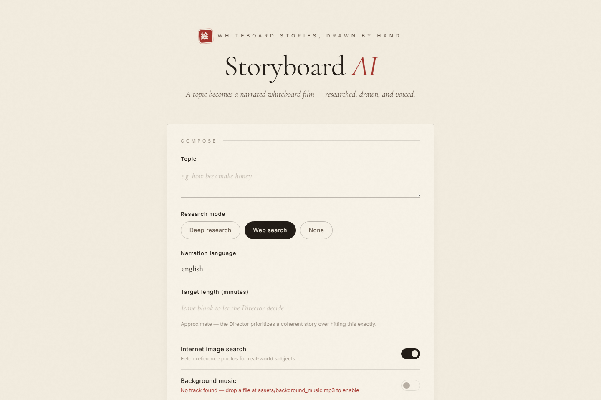

# Storyboard AI

Turn a single text prompt into a fully narrated whiteboard-animation video.



Give it a topic ("The History of Space Travel") and the pipeline researches it on the web, writes a script, plans scenes, generates whiteboard-style artwork, animates the drawing stroke by stroke, synthesizes the voiceover, times subtitles, and stitches everything into one final MP4 — autonomously.

Built on an **open / bring-your-own-model stack**: any OpenAI-compatible LLM (Ollama, LM Studio, DeepSeek, Groq, OpenRouter, OpenAI...), FLUX image generation via Hugging Face, and fully local Kokoro TTS + faster-whisper subtitles. No single vendor lock-in.

## How It Works

```
topic prompt
   │
   ▼
1. Research        — web search (SearXNG / DuckDuckGo / Wikipedia) or deep research
2. Director agent  — breaks the topic into scenes, writes narration per scene
3. Reference search— finds real reference images for people/places (optional)
4. Image gen       — FLUX renders whiteboard line-art per scene
5. Animation       — strokes are traced into a hand-drawn whiteboard animation
                     (optional SAM 3 segmentation for multi-pass object drawing)
6. TTS             — Kokoro narrates each scene locally
7. Subtitles       — faster-whisper transcribes + burns timed subtitles
8. Assembly        — scenes merged, paced to the audio, concatenated into one MP4
```

Because static line-art is stretched and paced to match the narration, a multi-minute video needs only a handful of generated images — no expensive per-second video-generation API calls (Veo video segments are optional).

## Repository Structure

```
pipeline/          Core pipeline (CLI + web app)
  pipeline.py      End-to-end pipeline entry point (interactive CLI)
  webapp.py        FastAPI web UI (progress tracking, ETA, video download)
  config.py        All configuration (models, endpoints, tuning)
  tools/           One module per pipeline stage (director, image gen, TTS, ...)
  static/          Web UI frontend
  assets/          Drawing-hand overlay images
  output/          Generated runs land here (gitignored)
sam3-hosting/      Optional: self-host SAM 3 segmentation on GCP Cloud Run
searxng/           Config for the optional self-hosted SearXNG search engine
pyproject.toml     Project metadata + dependencies (managed with uv)
```

## Requirements

- **Python 3.11+** and **[uv](https://docs.astral.sh/uv/getting-started/installation/)** (dependency management)
- **[FFmpeg](https://ffmpeg.org/download.html)** on your PATH (video/audio assembly)
- **Docker** (optional) — only for the self-hosted SearXNG search engine
- **API keys** (all have free options):
  - A text LLM: any OpenAI-compatible endpoint — free options include Ollama/LM Studio (local) or Groq/DeepSeek free tiers
  - Image generation (at least one): `PUTER_AUTH_TOKEN` — free [Puter](https://puter.com) account (primary; FLUX first, then other models). Get the token with `node pipeline/tools/puter/puter_gen.mjs login` (needs Node.js). And/or `HF_API_KEY` — Hugging Face token for FLUX (fallback, free monthly credits).
  - `VISION_API_KEY` — a vision-capable model (Groq's free tier works) — only needed if your text model can't see images
  - `GEMINI_API_KEY` — **optional**, only for Veo AI-video segments

TTS (Kokoro) and subtitles (faster-whisper) run fully locally — no keys needed.

## Setup

### 1. Install dependencies

```bash
git clone https://github.com/exc33ded/storyboard-ai.git
cd storyboard-ai
uv sync
```

(`uv sync` creates `.venv` and installs everything from `pyproject.toml`/`uv.lock`. If you prefer pip: `pip install -r requirements.txt`.)

### 2. Configure environment

```bash
cp pipeline/.env.example pipeline/.env
```

Then edit `pipeline/.env`:

```ini
# Text LLM — any OpenAI-compatible endpoint
TEXT_API_KEY="your-api-key"
# TEXT_BASE_URL="http://localhost:11434/v1"   # e.g. Ollama
TEXT_MODEL="gpt-4o-mini"

# Vision LLM (only if TEXT_MODEL has no vision) — Groq free tier works
VISION_API_KEY="your-groq-api-key"

# Image generation via Hugging Face
HF_API_KEY="your-huggingface-token"

# Optional: Veo video generation
# GEMINI_API_KEY="your-google-api-key"
```

See `pipeline/.env.example` for every option (voices, whisper model size, SearXNG URL, etc.). Model defaults and tuning live in `pipeline/config.py`.

### 3. (Optional) Self-hosted search with SearXNG

Web research falls back to DuckDuckGo/Wikipedia out of the box. For free, private, unlimited search, run SearXNG with one command (needs Docker running):

```bash
docker compose up -d
```

Then set `SEARXNG_URL="http://localhost:8888"` in `pipeline/.env`. The bundled `searxng/settings.yml` already enables the JSON API the pipeline needs, and the container auto-restarts whenever Docker is running. If SearXNG isn't up, search simply falls back to DuckDuckGo/Wikipedia.

### 4. (Optional) SAM 3 segmentation

By default the whiteboard animation draws in single-pass mode — no extra setup. For advanced multi-pass object-by-object drawing, host the SAM 3 server and set `SAM_API_URL` in `pipeline/config.py`. See [sam3-hosting/README.md](./sam3-hosting/README.md) for the Docker + GCP Cloud Run guide.

## Running

### Web app (recommended)

```bash
cd pipeline
uv run uvicorn webapp:app --port 8000
```

Open http://127.0.0.1:8000 — enter a topic, pick options, watch progress with a live ETA, and download the finished video.

> [!NOTE]
> The **target length is approximate**. The Director prioritizes a coherent story over hitting the number exactly, so the final video can run noticeably longer (roughly up to ~40% over) or shorter than requested.

### CLI

```bash
cd pipeline
uv run python pipeline.py
```

The interactive CLI walks you through: topic, research mode (deep / web / none), reference-image search, fast mode (parallel scene generation), narration language, and Veo on/off.

### Output

Each run is saved under `pipeline/output/run_<timestamp>/`:

- `storyboard_final_video.mp4` — the finished narrated video with subtitles
- `scene_<N>/` — per-scene images, audio, subtitles, and sketch videos
